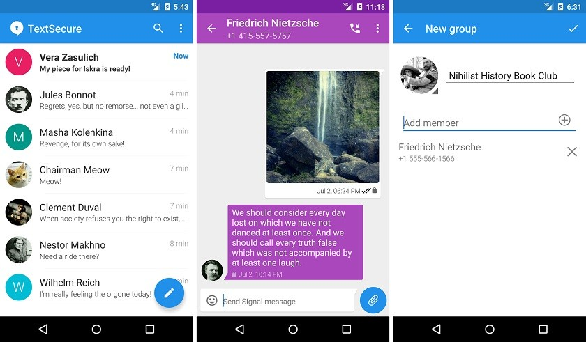

+++
date = "2016-09-05T16:15:43+10:00"
draft = true
title = "Time to change WhatsApp for Signal"
author= "pamr"
+++

WhatsApp has drastically changed its terms and conditions.

If privacy is important to you, install Signal and ask your family and friends to use it too. If you will keep using WhatsApp, you should harden its settings, [here is how](https://look.for.a.link.to.this).

In 2014, Facebook bought WhatsApp, an event that triggered alarm bells for me and many others . WhatsApp quickly responded with a blog [post](https://blog.whatsapp.com/529/Setting-the-record-straight) claiming: **“Respect for your privacy is coded into our DNA”** and **“If partnering with Facebook meant that we had to change our values, we wouldn’t have done it”**.

But it seems their word is not their bond.

Just two years later, on August 25th, WhatsApp changed its terms and conditions and we all saw this message on our phones. Many undoubtedly just tapped on “Agree” without thinking twice, as we have unfortunately been trained to do. But this change is big and, to our opinion, dangerous.

## So, what changed in terms of privacy?
WhatsApp will allow businesses to contact you and wil be sharing your phone number, your contacts, the last time you use the app, among other information with [Facebook and the Facebook family](https://www.facebook.com/help/111814505650678).

**WhatsApp says you can opt out from sharing your information, that is not 100% true.**

_“If you are an existing user, you can choose not to share your account information with Facebook to improve your Facebook ads and products experiences.”_ - from [WhatsApp FAQs](https://www.whatsapp.com/faq/en/general/28030012).

Here is what you need to know:

* By default you are sharing your information, you need to explicitly opt out. Here is how.
You need to **opt out before September 25**, if you haven’t opted out by then, you won’t be able to. ([see option 2 in their FAQs](https://www.whatsapp.com/faq/general/26000016)).

* If you are a new user, you don’t have this choice

* See that  part where it says _“to improve your Facebook ads and products experiences”_? That means that, even if you opt out, WhatsApp is still going to share your data with Facebook (and Facebook family), just for other purposes.

If privacy is important to you, you need to switch to a better alternative.

## Introducing Signal
[Signal](https://whispersystems.org/) is a secure messaging application, developed by [Open Whisper Systems](https://en.wikipedia.org/wiki/Open_Whisper_Systems), who created the protocol WhatsApp recently adopted to encrypt conversations.

### It is free of charge
Signal is supported by donations and grants. They don’t have a business model, they don’t sell users’ personal data for profit.

### Private texts and calls
All messages and calls are private, Signal doesn’t have access to your conversations and no one else does either.

### It is Open Source
Anyone can look at how the application is built and make sure it is safe, or suggest ways to improve it. Security by obscurity has never worked.

### Desktop Client
Signal has a desktop client in beta version available for Android users on the [Chrome Web Store](https://chrome.google.com/webstore/detail/signal-private-messenger/bikioccmkafdpakkkcpdbppfkghcmihk).

Given WhatsApp’s change of attitude towards privacy, it is time to move on from it and start using [**Signal**](https://whispersystems.org/), an app that allows you to communicate with the people you want without having to share personal data with advertising companies and other businesses.